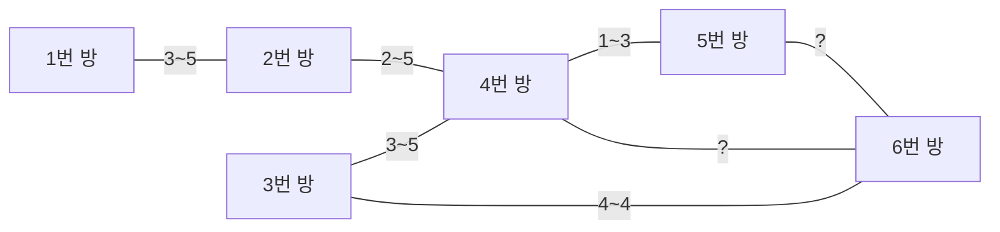

# 문제 3. 개미굴의 미정 통로 범위 찾기

## 문제 설명

개미굴에는 `1`번부터 `n`번까지의 개미방이 있습니다.
개미는 항상 `1`번 방에서 출발하며, `n`번 방에 도착할 수 있는지 확인하려고 합니다.

각 통로는 `[a, b, c, d]` 형태로 주어집니다.
이는 `a`번 방과 `b`번 방을 연결하는 **양방향 통로**이며,
크기가 `c` 이상 `d` 이하인 개미만 통과할 수 있음을 의미합니다.

단, `c = 0`이고 `d = 0`인 통로는 아직 조건이 정해지지 않은 **미정 통로**입니다.
모든 미정 통로는 동일한 하나의 크기 구간 `[x_min, x_max]`를 공유합니다.
즉, 어떤 미정 통로든 크기가 `x_min` 이상 `x_max` 이하인 개미만 통과할 수 있습니다.

정수 배열 `ants`에는 `n`번 방에 도착한 것이 관찰된 개미들의 크기가 오름차순으로 주어집니다.
단, 이 배열은 **전체 도착 개미 정보를 모두 담고 있지는 않습니다.**
즉, `ants`에 없는 크기의 개미가 추가로 `n`번 방에 도착할 수도 있습니다.

`ants`에 포함된 모든 개미가 `1`번 방에서 출발해 `n`번 방에 도착할 수 있도록 하는
가장 타이트한 미정 통로의 구간 `[x_min, x_max]`를 구해 return 하려고 합니다.

여러 답이 가능하면, **시작값이 가장 작은 구간**을 선택합니다.
문제에서 정답이 항상 존재하는 경우만 입력으로 주어집니다.

---

## 제한사항

- `2 <= n <= 100`
- `n - 1 <= len(edges) <= 500`
- `1 <= len(ants) <= 50`
- `1 <= ants[i] <= 50`
- `ants`는 중복이 없고 오름차순입니다.
- `edges[i] = [a, b, c, d]`
- `1 <= a, b <= n`
- `0 <= c, d <= 50`
- `c = d = 0`인 통로들은 모두 같은 미정 구간 `[x_min, x_max]`를 공유합니다.

---

## 입출력 예

| n   | edges                                                                                                | ants                   | result   |
| --- | ---------------------------------------------------------------------------------------------------- | ---------------------- | -------- |
| 6   | `[[1, 2, 3, 5], [2, 4, 2, 5], [3, 4, 3, 5], [4, 5, 1, 3], [3, 6, 4, 4], [4, 6, 0, 0], [5, 6, 0, 0]]` | `[3, 4, 5]`            | `[3, 5]` |
| 6   | `[[1, 2, 3, 5], [2, 4, 2, 5], [3, 4, 3, 5], [4, 5, 1, 3], [3, 6, 4, 4], [4, 6, 0, 0], [5, 6, 0, 0]]` | `[4]`                  | `[1, 1]` |
| 2   | `[[1, 2, 7, 11], [1, 2, 0, 0]]`                                                                      | `[4, 7, 8, 9, 10, 11]` | `[4, 4]` |
| 2   | `[[1, 2, 2, 2], [1, 2, 4, 4], [1, 2, 0, 0]]`                                                         | `[2, 4]`               | `[1, 1]` |

---

## 예시 1 그래프 시각화

`?` 통로들은 모두 같은 미정 구간 `[x_min, x_max]`를 공유합니다.

---

## 입출력 예 설명

### 예시 1

크기 4인 개미는 이미 고정 통로만으로도 6번 방에 도착할 수 있습니다.
하지만 크기 3, 5인 개미는 미정 통로를 활용해야 하므로,
미정 통로 구간이 최소한 `[3, 5]`를 포함해야 합니다.
가장 타이트한 구간은 `[3, 5]`입니다.

### 예시 2

크기 4인 개미는 고정 통로만으로도 6번 방에 도착할 수 있습니다.
따라서 미정 통로가 실제로 어떤 크기를 허용하든 상관없습니다.
길이 1의 구간 중 시작값이 가장 작은 답은 `[1, 1]`입니다.

### 예시 3

크기 7 이상 11 이하 개미는 고정 통로만으로 도착할 수 있습니다.
크기 4인 개미만 미정 통로가 필요하므로 정답은 `[4, 4]`입니다.

### 예시 4

크기 2와 4는 모두 고정 통로만으로 도착할 수 있습니다.
따라서 가장 짧고 시작값이 가장 작은 구간 `[1, 1]`을 선택합니다.
